# BAS.Tor Documentation

Examples created on 1.3 version of the module and may be outdated

## Start Tor
Select `Tor network` from BAS elements list

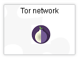

Then select `Start Tor`

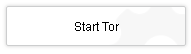

Here we can configure Tor

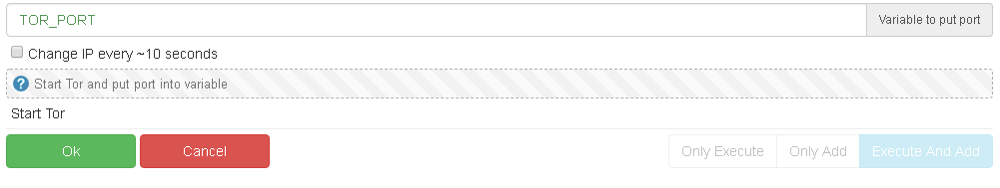

 - `TOR_PORT` - The variable that the module will put the port in. This will be a random port, and you can't set a specific port yet
 - `Change IP every ~10 seconds` - will force Tor to change IP every ~10 seconds

Now your Tor is running. But how to use it? For example, I will use a browser:

 - Configure proxy (localhost:[[TOR Port]] for IP and socks5 for type)
 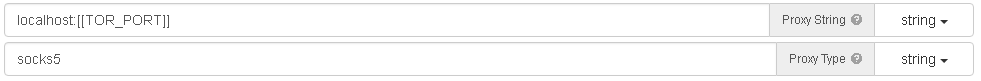
 - Then load any site to check your IP. I use `https://2ip.ru`
 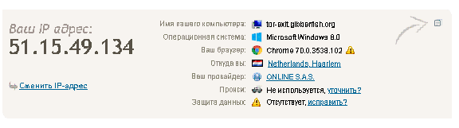
 
 You are done! Your Tor proxy is working.
 
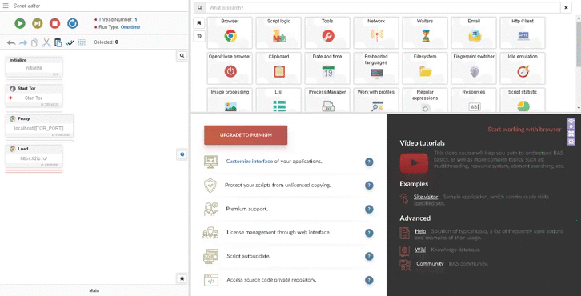

[Download example](https://github.com/katant/BAS.TorDocs/blob/master/start_tor.xml)
 
## Kill Tor
Tor still runs after script finish, so you need to kill it by yourself.

Select `Kill Tor`
 
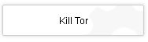
 
Here we can kill Tor
 
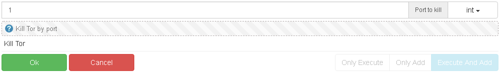
 
 - `Port to kill` - Your Tor port
  
[Download example](https://github.com/katant/BAS.TorDocs/blob/master/kill_tor.xml)
  
## Kill all Tors
If you don't know the exact Tor port, you can kill all of them

Select `Kill All Tors`
  
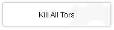
  
You can't configure anything there
  
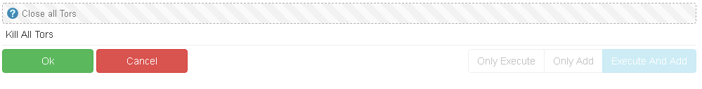
  
[Download example](https://github.com/katant/BAS.TorDocs/blob/master/kill_all_tors.xml)
 
## Change Tor IP
If you need to change Tor IP, select `New Tor circuit`
 
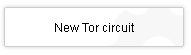
 
Here you can change Tor IP (New circuit)
 
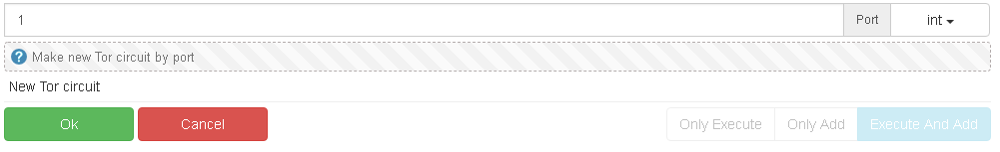
 
 - `Port` - Your Tor port
 
Note: You need to wait sometime after making a new circuit
 
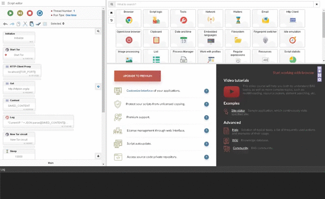

[Download example](https://github.com/katant/BAS.TorDocs/blob/master/change_tor_ip.xml)